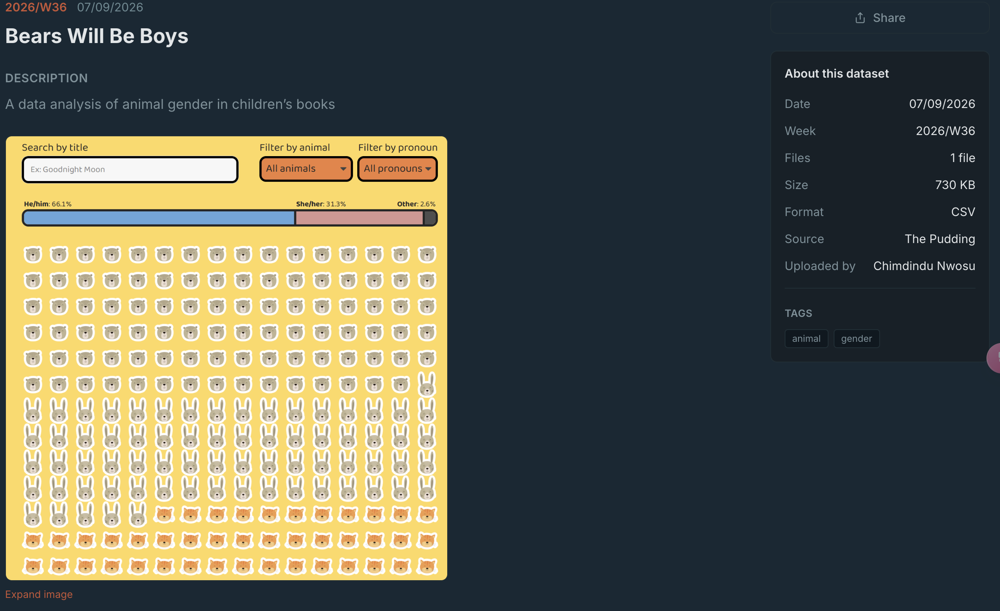
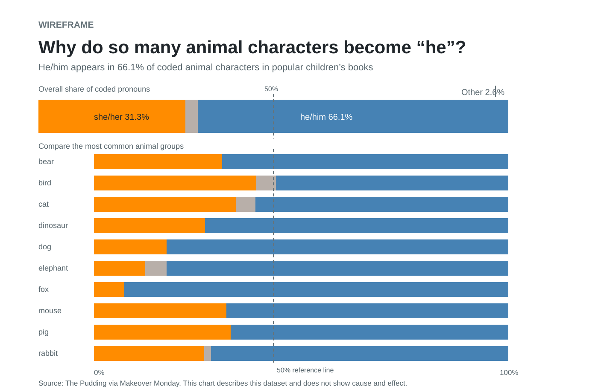
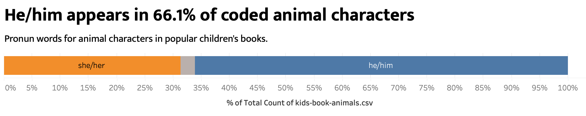

| [home page](https://jenniferliu02.github.io/Jennifer-visualizationportfolio-templates/) | [data viz examples](dataviz-examples) | [critique by design](critique-by-design) | [final project I](final-project-part-one) | [final project II](final-project-part-two) | [final project III](final-project-part-three) |

# Critique by Design: Bears Will Be Boys

## Step 1: Choose a visualization

**Visualization:** [Bears Will Be Boys](https://makeovermonday.vercel.app/dataset/bears-will-be-boys), Makeover Monday. The page credits The Pudding as the source.

I chose the chart shown on the Makeover Monday page. It studies pronoun words for animal characters in children’s books. The top bar shows he/him 66.1%, she/her 31.3%, and other 2.6%. Below the bar, a large grid repeats animal faces.

The image above shows the original chart. Use the [original Makeover Monday page](https://makeovermonday.vercel.app/dataset/bears-will-be-boys) to explore its search box and filters.

I chose this chart because it has a clear topic and public data. The main result matters, but the crowded icon grid makes the result less immediate. I want a reader to see the overall result first and then compare animal groups.

## Step 2: Critique the original visualization

### What the image shows

The chart has a yellow panel, a title, a search box, and two filters. A stacked bar shows three pronoun shares. Many bear, rabbit, and cat faces fill the space below the bar. The image does not explain what one face represents or why the animals appear in that order.

### Data Visualization Effectiveness Profile

| Form category | Score | Reason |
|---|---:|---|
| Usefulness | 7/10 | It gives a useful result. He/him appears much more often than she/her. The animal face grid makes that result harder to find. |
| Completeness | 5/10 | It labels the three totals and provides filters. It does not explain the animal faces, their order, or what one face stands for. |
| Perceptibility | 5/10 | Readers can read the top bar quickly. They cannot compare the many small faces with little effort. |
| Truthfulness | 6/10 | It gives exact percentages and names The Pudding as a source. The image alone does not explain the counting method or how filters change the values. |
| Intuitiveness | 5/10 | Search and filter controls feel familiar. The animal grid has no short instruction. |
| Aesthetics | 6/10 | The animal faces feel friendly, but the bright yellow panel and many repeated icons compete for attention. |
| Engagement | 7/10 | The filters invite exploration. The crowded grid may stop a reader before they explore. |

### Text for the Google Form

**What visualization are you ranking?**  
*Bears Will Be Boys*, Makeover Monday, https://makeovermonday.vercel.app/dataset/bears-will-be-boys

**Overall observations**  
The top bar communicates the key result. He/him makes up 66.1% of coded animal characters. She/her makes up 31.3%, and other makes up 2.6%. Direct labels help readers understand the colors.

The large animal face grid takes most of the space. I cannot tell what one face means or why the chart uses this order. The repeated faces and yellow background make the page busy. The filters may help, but the image does not explain how a reader should use them. The redesign should make the overall comparison clear and add only useful detail.

**Who is the primary audience? Is it effective for that audience?**  
The audience includes parents, teachers, writers, illustrators, and general readers who care about children’s books. The animal images may attract this audience because the topic feels familiar and personal. Peck’s *Data is Personal* explains why a reader may care more when a chart connects with everyday life.

The original chart only partly works for this audience. A reader can see the main percentage, but the page does not explain the icon grid. The redesign gives a clear title, a simple description, and a direct comparison by animal group.

**What will you focus on in the redesign?**  
I will focus on one message: he/him appears in about two out of three coded animal characters in this dataset. I will use a 100% stacked bar for the overall result. I will add 100% stacked bars for the ten most common animal groups so readers can see where the pattern changes. I will use blue for he/him, orange for she/her, and gray for other. Direct labels will repeat the color meaning.

I will add a short subtitle close to the chart, a source note, and a 50% reference line. I will state that the chart describes this dataset. It does not show cause and effect.

### Reflection on the critique method and readings

Stephen Few’s form helped me separate a friendly chart from a clear chart. The animal faces make the image interesting, but they do not make the main data easier to compare. The form showed that the chart has good engagement but weaker completeness and perceptibility.

Viégas and Wattenberg say that a redesign needs a clear goal, the same data, and honest notes about a simpler view. My goal is to make the overall result easy to read and then add a focused animal group comparison. I use the same data and do not claim that this view shows every detail of the original interactive page.

The color guidance shaped my plan. I use only three data colors. Blue and orange distinguish the two larger groups. Gray makes the small other group recede. Labels provide a second cue, so readers do not need color alone. The course video on correlation and causation shaped the noncausal note.

## Step 3: Sketch a solution

**Goal:** Help a reader see the overall result in less than ten seconds, then compare the most common animal groups.

**Chart type:** One 100% stacked horizontal bar for the total and a second 100% stacked bar chart by animal group.

**Title:** “Why do so many animal characters become ‘he’?”

**Subtitle:** “He/him appears in 66.1% of coded animal characters in popular children’s books.”

**Design choices:**

- Put the main result at the top.
- Add an overall bar before the animal group bars.
- Label the large bar sections directly.
- Use blue for he/him, orange for she/her, and gray for other.
- Use a white background and gray notes.
- Add a thin 50% reference line.
- Do not use a decorative animal grid.

## Step 4: Test the solution

### First redesign prototype used for testing

Before I built the dashboard, I showed this first redesign to both participants. It focuses on the overall result. Their feedback shaped the final Tableau dashboard below.

**Test script:** “Please look at this chart for 30 seconds. I will not explain it first. I am testing the chart, not you.”

I asked each participant what the chart showed, what the main result was, what the colors meant, what felt unclear, and whether the chart showed cause or only described the dataset. I do not include names or contact information.

| Participant description | What they understood | Feedback | Change in the final version |
|---|---|---|---|
| Student, mid 20s, MISM BIDA program, previous data visualization experience | The participant quickly saw that he/him takes about two thirds of the bar. | They suggested a pie chart, said labels reduce the need for color, asked for a stronger title, and wanted the description closer to the chart. | I kept a stacked bar because the straight baseline supports more accurate comparison than pie slices. I kept limited color plus direct labels. I moved the description close to the chart and used a takeaway title. |
| Student, MISM program, with professional data visualization experience | The participant understood the main message at once and said the stacked bar has much less cognitive load than the icon grid. | They supported the stacked bar, asked for a 50% reference line, a clearer small other group, a closer subtitle, and dark text on orange. | I added the 50% line, placed the subtitle close to the chart, used dark text on orange, and kept direct labels. |

### What I learned from both participants

Both participants understood the main result without help. This supports removing the animal icon grid. One participant suggested a pie chart, but the other explained why a stacked bar works better. A stacked bar gives all groups a straight baseline, so readers can compare shares with less effort than pie angles.

The feedback also improved the layout. The title now states a takeaway. The subtitle sits close to the visual. The 50% reference line makes it clear that he/him passes the halfway point. The final design uses labels and color together.

## Step 5: Build the final redesign

### Final Tableau dashboard

[Open the final Tableau dashboard](https://public.tableau.com/app/profile/jennifer.liu4619/viz/CritiquebyDesignBearsWillBeBoys/Dashboard1?publish=yes)

<iframe src="https://public.tableau.com/views/CritiquebyDesignBearsWillBeBoys/Dashboard1?:showVizHome=no" width="100%" height="820" frameborder="0" title="Bears Will Be Boys redesign"></iframe>

### What the redesign shows

The top bar gives the overall shares from the original image: he/him 66.1%, she/her 31.3%, and other 2.6%. The chart below compares the pronoun shares within the ten most common animal groups. Each row totals 100%, which makes the comparison clear.

### What I changed and why

I removed the large animal face grid. The screenshot did not explain its unit or order. I kept the overall shares and gave them space at the top. I added a second chart by animal group, so readers can see detail without losing the total comparison.

I used a takeaway title and a subtitle that states the main result. I added a 50% reference line. I used only three data colors. Direct labels give the same meaning as the colors and support readers with color vision differences. I kept the stacked bar instead of a pie chart because its straight baseline makes shares easier to compare.

This chart describes coded animal characters in this dataset. It does not show that books cause pronoun choices.

## Sources and AI use

- [Makeover Monday: Bears Will Be Boys](https://makeovermonday.vercel.app/dataset/bears-will-be-boys). Accessed September 17, 2026.
- Walsh, Melanie, Russell Samora, Michelle Pera McGhee, and Jan Diehm. [Bears Will Be Boys](https://pudding.cool/2025/07/kids-books/). *The Pudding*, 2025.
- Few, Stephen. [Data Visualization Effectiveness Profile](http://www.perceptualedge.com/articles/visual_business_intelligence/data_visualization_effectiveness_profile.pdf). 2017.
- Viégas, Fernanda, and Martin Wattenberg. [Design and Redesign in Data Visualization](https://medium.com/@hint_fm/design-and-redesign-4ab77206cf9). 2015.
- Peck, Evan. [Data is Personal: What We Learned from 42 Interviews in Rural America](https://medium.com/multiple-views-visualization-research-explained/data-is-personal-what-we-learned-from-42-interviews-in-rural-america-93539f25836d). 2019.
- Course video: *Correlation, Causation & Misleading Data Claims*.

**AI use disclosure:** OpenAI Codex was used solely for grammar checking, typo correction, and language polishing. .
