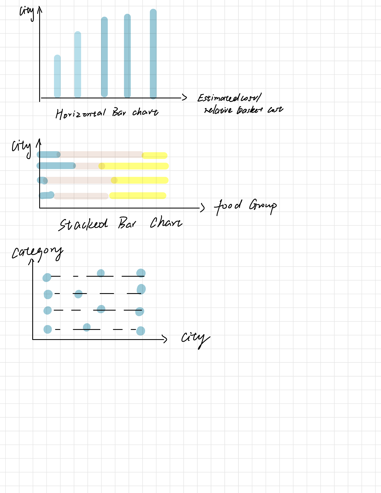

| [home page](README.md) | [data viz examples](dataviz-examples.md) | [critique by design](critique-by-design.md) | [final project I](final-project-part-one.md) | [final project II](final-project-part-two.md) | [final project III](final-project-part-three.md) |

# Final Project Part I

# Same Basket, Different City

## How far does the same grocery budget go across American cities?

# Outline

## Project overview

A fixed grocery budget does not provide the same purchasing power everywhere. A young adult may plan to spend the same amount on groceries each week, but local food prices can change what that money can actually buy.

For my final project, I want to compare the cost of the same standardized grocery basket across major U.S. metropolitan areas. I will keep the food categories and quantities consistent across cities. This approach will let me focus on geographic price differences instead of differences in personal shopping habits.

My primary audience includes college students, graduate students, and young adults who manage their own living expenses or plan to move to another city. These readers may know that some cities cost more than others, but broad cost of living indexes do not always show what those differences mean in everyday life.

I want to turn an abstract cost comparison into a concrete shopping experience. Instead of only showing that one city has a higher food price index, I want readers to see how an identical basket changes in price and how a fixed budget stretches differently depending on location.

## One sentence summary

The same grocery basket does not cost the same everywhere, and where you live changes how far the same food budget can go.

## Audience

My main audience includes college students, graduate students, and young adults who manage a limited budget.

I want the project to use simple language and familiar objects such as grocery baskets, receipts, food groups, and dollar amounts. Readers should not need a background in economics or statistics to understand the story.

## User story

As a young adult managing my own budget, I want to understand how grocery costs change across cities so that I can make more realistic decisions about everyday living expenses.

## Reader takeaway

After reading the story, I want readers to understand three ideas.

1. The same dollar amount does not create the same purchasing power in every city.

2. Different food categories contribute differently to geographic price differences.

3. Local prices can matter when someone creates a budget for school, work, or relocation.

## Call to action

Before creating a budget for a new city, readers should compare local food prices instead of relying only on national averages.

# Story structure

## Section 1: Same basket, same budget

I will start with a simple scenario.

A young adult has the same grocery list and the same budget in several U.S. cities.

The opening page will introduce the question:

> How much does location change the cost of the same grocery basket?

I want this section to stay visually simple. It will introduce the basket before showing any city results.

## Section 2: The basket stays the same. The bill does not.

The first visualization will compare the total estimated cost of the same basket across metropolitan areas.

I will use a horizontal bar chart because it allows readers to compare city totals quickly.

I will sort cities by basket cost so that the reader can immediately see the overall range.

The main question for this section will be:

> Which cities make the same grocery basket cost more?

## Section 3: Open the receipt

After showing the total difference, I will break the basket into major food groups.

Possible groups include:

1. Grains
2. Vegetables
3. Fruit
4. Dairy
5. Protein

I will use a stacked bar chart to show how each group contributes to the total basket cost.

This section will answer a second question:

> What actually creates the difference between cities?

I also want to create a receipt style visual for selected cities. The receipt will show the food groups, their estimated costs, and the total basket cost.

This format will make the data feel more connected to a real shopping experience.

## Section 4: What actually costs more?

The next section will compare specific food categories across cities.

I plan to use a dot plot for this comparison.

Each row will represent one food category. Each point will represent one city.

This visualization should make it easier to see which categories show large geographic differences and which categories remain relatively similar.

## Section 5: The geography of the grocery bill

I may use a symbol map to show the metropolitan areas in the dataset.

Each point will represent one metropolitan area. The size of the point will represent the relative basket cost or food price index.

This visualization will help readers see whether geographic patterns appear across the cities.

## Section 6: Prices also change over time

If the time series data supports a meaningful comparison, I will use a line chart to show food price changes across several metropolitan areas.

I will not include this visualization only for variety. I will keep it only if the time trend adds useful information to the story.

## Section 7: Same money, different basket

This section will serve as the main visual peak of the story.

Instead of showing another price index, I will return to a fixed dollar budget.

For example, I may use $50 or $100. I will choose the final amount after I explore the data.

Each city will start with the same amount of money. The visualization will show how much of the standardized basket that amount can purchase.

One city may cover the full basket while another city may require tradeoffs.

The main message will be:

> Same money does not always mean the same purchasing power.

## Section 8: What this means for a budget

The final section will return to the original question.

I will summarize the main pattern and explain why local food prices matter when someone plans a budget for a new city.

The conclusion will not tell readers which city they should choose. It will show why they should consider local prices when they compare living costs.

# Initial sketches

The following sketch shows my initial ideas for three core visualizations.

### Sketch 1: Horizontal bar chart

The first sketch compares cities by estimated basket cost.

Each bar represents one city. The horizontal axis represents the estimated cost or relative basket cost.

I plan to sort the cities by value so that readers can compare the overall differences quickly.

### Sketch 2: Stacked bar chart

The second sketch breaks each city's grocery basket into food groups.

Each segment represents a major category such as grains, vegetables, fruit, dairy, or protein.

This chart will help readers understand which categories contribute most to each city's total basket cost.

### Sketch 3: Dot plot

The third sketch compares food categories across cities.

Each row represents one category. Each point represents a city.

I want this chart to show whether certain food categories create larger geographic differences than others.

## Additional storyboard ideas

I also plan to develop several visual elements beyond the three charts in my initial sketch.

### Receipt comparison

I want to create a receipt style comparison for two or more cities.

For example:

| New York | Chicago |
| --- | --- |
| Grains: $XX | Grains: $XX |
| Vegetables: $XX | Vegetables: $XX |
| Fruit: $XX | Fruit: $XX |
| Dairy: $XX | Dairy: $XX |
| Protein: $XX | Protein: $XX |
| **Total: $XX** | **Total: $XX** |

This design will make the comparison feel more familiar than a traditional statistical chart.

### Fixed budget visualization

Near the end of the story, I want to show what happens when every city receives the same grocery budget.

For example:

**City A**

Budget: $100

Basket covered: 100 percent

**City B**

Budget: $100

Basket covered: 87 percent

**City C**

Budget: $100

Basket covered: 74 percent

I will use the real data to choose the final cities, budget amount, and percentages.

# The data

## Primary data source

I plan to use the USDA Food at Home Monthly Area Prices dataset as the main source for geographic food price information.

The dataset contains monthly food price information for multiple U.S. metropolitan areas and food categories. It includes measures that can support both geographic comparisons and time based comparisons.

I plan to use the data to calculate or compare the relative cost of a standardized grocery basket across metropolitan areas.

I will first select a manageable set of food categories. I will then group them into broader categories such as grains, vegetables, fruit, dairy, and protein.

I will keep the basket structure consistent across cities. This approach will allow the project to focus on geographic price variation.

## Basket definition

I do not want to claim that every college student buys the same products.

Instead, I will create a standardized comparison basket.

The basket will use the same categories and quantities for every city.

I may also use USDA food plan guidance to make the basket more systematic.

I will clearly explain how I choose the categories and quantities.

The basket will function as a comparison tool. It will not represent the shopping behavior of every student or young adult.

## Data use

I plan to use the data for several different questions.

| Question | Planned visualization |
| --- | --- |
| Which city has the highest basket cost? | Horizontal bar chart |
| What food groups contribute to the total? | Stacked bar chart |
| Which categories show the largest city differences? | Dot plot |
| Do geographic patterns appear? | Symbol map |
| Do prices change differently over time? | Line chart |
| What can the same fixed budget buy? | Custom basket or receipt visualization |

## Data sources

| Name | Description |
| --- | --- |
| USDA Food at Home Monthly Area Prices | Main source for food price comparisons across metropolitan areas |
| USDA food plan data | Possible source for defining a standardized grocery basket |

I will add direct public dataset links after I finalize the exact files that I use for the analysis.

## Data limitations

The project will clearly explain the limitations of the data.

First, the available price data may cover a historical period rather than current prices. I will identify the exact years in the final project and avoid presenting historical data as current prices.

Second, the dataset covers selected metropolitan areas. I will not generalize the findings to every U.S. city.

Third, the standardized basket will support comparison. It will not represent every person's real grocery purchases.

# Method and medium

I plan to use Shorthand to build the final narrative website.

I plan to use Tableau to create the main data visualizations, including the horizontal bar chart, stacked bar chart, dot plot, map, and line chart.

I also plan to create simple information design elements such as grocery receipts, price labels, and basket visuals. These elements will connect the statistical analysis to a familiar shopping experience.

I want the final project to feel like an interactive editorial data story instead of a dashboard.

The visual style will use a clean grocery and receipt theme. I will use consistent typography, spacing, and category colors throughout the story.

I will keep each section focused on one main question.

# Planned visual style

## Visual theme

I want the project to use a modern grocery and receipt inspired visual style.

Possible visual elements include:

1. Grocery receipts
2. Shopping baskets
3. Price labels
4. Checkout totals
5. Simple food category icons

## Tone

The project will use a clear and approachable tone.

I want the project to feel informative and visually engaging without making the design distracting.

## Layout

I plan to use large section titles, short explanations, and clear visual hierarchy.

Each section will introduce one question and one main visual answer.

I will avoid a dense dashboard layout.

# References

U.S. Department of Agriculture Economic Research Service. Food at Home Monthly Area Prices.

U.S. Department of Agriculture. USDA Food Plans.

Course materials from 94 870 Telling Stories with Data.

# AI acknowledgements

I used ChatGPT to help brainstorm the project structure, organize the story arc, revise the wording, and connect possible chart types to the questions in the project.

I reviewed the project idea, selected the final direction, created the initial visualization sketches, and will complete the data analysis and final visual design.
