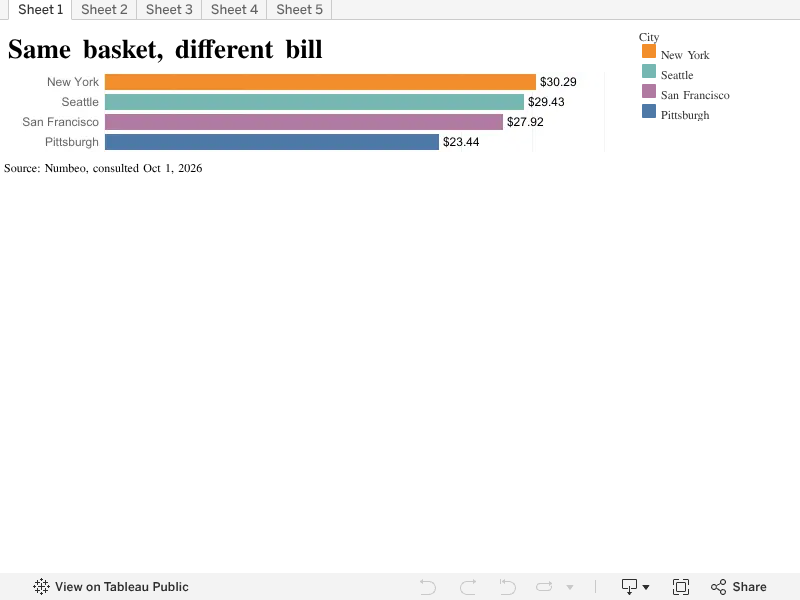
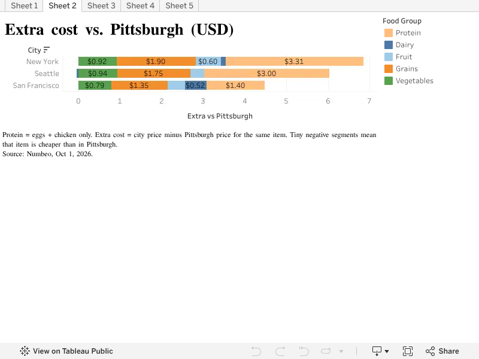
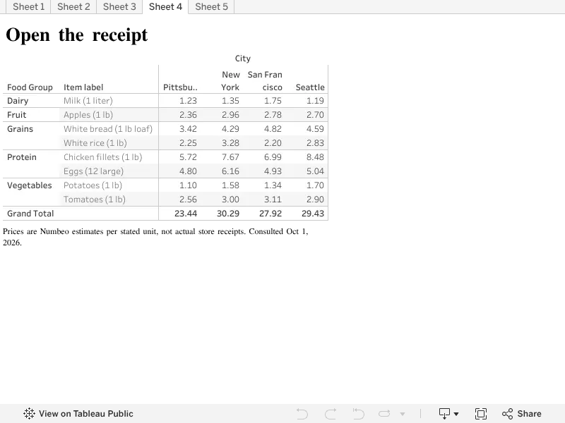
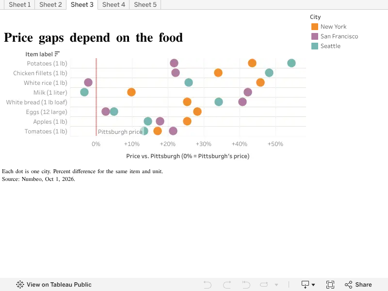
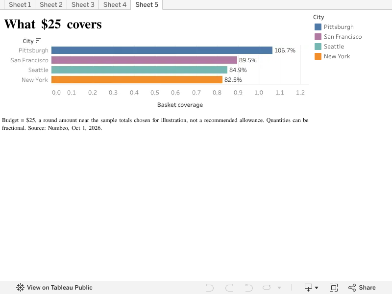

| [home page](README.md) | [data viz examples](dataviz-examples.md) | [critique by design](critique-by-design.md) | [final project I](final-project-part-one.md) | [final project II](final-project-part-two.md) | [final project III](final-project-part-three.md) |

# Final Project Part II
# Same Basket, Different City
## An exploratory grocery-price comparison for students considering a move

**Draft status:** Storyboard, five published Tableau visualizations, data documentation and interview protocol are available below. One friend's written feedback is documented below. The required three-person interview process and cross-interview synthesis are not yet complete; the revision plan is provisional.

**Read this comparison as an illustration, not a city ranking.** Numbeo combines user contributions with manually collected information. Its rolling estimates are not official representative city averages or a uniform 2026 survey. October 1, 2026 is the date the pages were consulted, not a common observation date for all prices.

[Open the five-sheet Tableau workbook](https://public.tableau.com/views/Finalproject_17908994232220/Sheet1?:tabs=yes&:showVizHome=no) · [Download/view the 32 source entries](part-two-grocery-prices.csv)

**Main message:** In this eight-item comparison, the estimated basket totals differ across the four cities. The gaps come from particular foods and food groups; prices are not uniformly higher for every item.

**Reading path:** Start with the total bill → identify which groups add dollars → inspect the receipt → compare item-level percentages → translate the total into $25 of model basket coverage.

[Read the story](#wireframes--storyboards) · [Data and methods](#data-methods-and-reproducibility) · [Interview protocol](#user-research-protocol) · [Feedback and revisions](#interview-findings) · [Assignment check](#assignment-requirements-check)

How this draft develops Part I and responds to the instructor

### Development from Part I and instructor feedback

This draft keeps the original sequence: introduce the basket, compare totals, open the receipt, examine food differences, return to a fixed budget and end with a modest budgeting takeaway. It continues the horizontal bar, stacked bar and dot-plot sketches from [Part I](final-project-part-one.md), with two refinements:

- The stacked chart now shows **category contributions to the difference from Pittsburgh**, rather than total category spending. This more directly answers “What creates the difference?”
- The dot plot now shows **individual foods as percentage differences from Pittsburgh**, making the baseline explicit while retaining the original city-comparison concept.

The original proposal used USDA Food-at-Home Monthly Area Prices, which covers 2012–2018 and does not include Pittsburgh, San Francisco or Seattle. The draft instead uses Numbeo city entries to explore this particular four-city comparison. This changes the geography from USDA metropolitan areas to Numbeo city definitions; the two datasets are not combined.

The instructor asked for clearer geographic scope and city-selection reasoning and encouraged a simple basket definition. All four places here are **U.S. cities**. Pittsburgh provides a familiar starting point for the CMU audience; New York, San Francisco and Seattle are selected relocation scenarios with available prices for the same items. This is a purposive comparison, **not a verified list of CMU graduates’ top destinations** and not a representative sample of U.S. cities.

In later guidance on the source change, the instructor emphasized prominent limitations, avoiding strong conclusions and considering what better data could reveal. This draft therefore describes patterns in the selected estimates, not actual student expenses or recommendations about where to move. The basket uses major food groups; detailed calculations appear after the story.

## Wireframes / storyboards

The sections below form a reading sequence rather than a dashboard. Each chart preview links to its interactive Tableau sheet. The existing three sketches remain documented in Part I.

### 1. Same basket, same budget

Imagine taking the same small grocery list to four cities. Before comparing the bills, hold the quantities constant.

| Food group | Items and fixed quantities |
|---|---|
| Grains | White bread: one 1 lb loaf; white rice: 1 lb |
| Vegetables | Tomatoes: 1 lb; potatoes: 1 lb |
| Fruit | Apples: 1 lb |
| Dairy | Milk: 1 liter |
| Protein | Eggs: 12 large; chicken fillets: 1 lb |

This eight-item list is an author-defined comparison basket. It is not a weekly meal plan, a complete diet or a claim about what every student buys. It uses the source’s displayed quantities consistently across cities.

**Reader question:** If the list stays the same, how much do the estimated bills differ?

### 2. The basket stays the same. The bill does not.

*Figure 1. Estimated basket total in USD. Source: Numbeo city Markets tables, consulted October 1, 2026. Exploratory rolling estimates, not representative city averages.*

The list totals **$23.44 in Pittsburgh, $27.92 in San Francisco, $29.43 in Seattle and $30.29 in New York**. The bars are sorted to make the range easy to compare. This ordering applies to these eight quantities and estimates; a different list, retailer or sample could produce a different result.

**Why the next chart uses dollars:** The total tells us how large the bill is. Subtracting Pittsburgh’s price for each group shows where the extra dollars come from.

### 3. Open the receipt: where does the extra cost come from?

*Figure 2. Food-group cost differences from Pittsburgh, in USD. Positive segments add to the gap; negative segments reduce it. Protein includes only eggs and chicken. Source: Numbeo, consulted October 1, 2026. These are illustrative Numbeo estimates, not representative city-wide grocery prices.*

Relative to Pittsburgh, the **net** difference is **+$6.85 for New York, +$5.99 for Seattle and +$4.48 for San Francisco**. For New York and Seattle, eggs and chicken together contribute $3.31 and $3.00 respectively. In San Francisco, grains contribute $1.35, close to the $1.40 contribution from protein.

These are arithmetic contributions within the selected list, not evidence about the economic causes of city food prices. Segments represent food-group sums: for example, Seattle’s dairy contribution is −$0.04 because the milk estimate is lower than Pittsburgh’s.

*Figure 3. A reconstructed receipt comparison. All amounts are USD per stated quantity; these are not actual store receipts. Source: Numbeo, consulted October 1, 2026. These are illustrative Numbeo estimates, not representative city-wide grocery prices.*

The receipt table lets readers inspect the entries behind the totals. **Why switch to percentages next?** A dollar gap measures the contribution to the bill; a percentage gap measures how different an item is relative to its Pittsburgh price. They answer different questions.

### 4. What actually costs more?

*Figure 4. Percentage difference for the same food and quantity. Pittsburgh is the 0% baseline; each colored dot represents another city. Source: Numbeo, consulted October 1, 2026. These are illustrative Numbeo estimates, not representative city-wide grocery prices.*

The pattern varies by food. Seattle’s chicken estimate is about **48.3% higher** than Pittsburgh’s, while its milk estimate is about **3.3% lower**. San Francisco’s rice estimate is about **2.2% lower**. A higher total does not mean every item is more expensive.

**A bigger percentage does not necessarily mean more extra dollars.** For Seattle, compare:

| Food and quantity | Pittsburgh | Seattle | Extra dollars | Relative difference |
|---|---:|---:|---:|---:|
| Potatoes, 1 lb | $1.10 | $1.70 | +$0.60 | +54.5% |
| Chicken fillets, 1 lb | $5.72 | $8.48 | +$2.76 | +48.3% |

Potatoes have the larger percentage gap, but chicken adds more dollars to the bill. The percentage uses each food’s own Pittsburgh price as its denominator.

### 5. The geography of the grocery bill

The comparison includes Pittsburgh and New York in the eastern U.S. and San Francisco and Seattle on the West Coast. These locations give the audience concrete scenarios, but four selected city entries cannot establish a national or regional pattern.

Part I proposed a possible symbol map. This draft does not add one because location alone would not explain the observed estimates. City selection and geographic scope are stated directly instead.

### 6. Prices also change over time — but this snapshot cannot show how

Part I made the time-series chart conditional on suitable data. No comparable repeated observations are included in this draft, so no trend line is drawn.

A stronger comparison would collect matching products and quantities at multiple documented stores in each city during the same periods, then repeat collection over time. It would also document store selection and variability. Such evidence could help distinguish persistent differences from changes in products, sample composition or collection dates.

This is a substantive limit: recent access to a rolling table does not turn it into a synchronized survey.

### 7. Same money, different basket

**Why return to the total?** After examining the sources of price differences, hold the available money fixed. Dividing $25 by each total turns the price comparison into a share of one model basket.

*Figure 5. Model basket coverage with $25: Pittsburgh 106.7%, San Francisco 89.5%, Seattle 84.9%, New York 82.5%. On the current interactive axis, 1.0 means 100% of one basket. Source: Numbeo estimates and author calculations. These are illustrative Numbeo estimates, not representative city-wide grocery prices.*

| Coverage | What it means in this model |
|---|---|
| 100% (1.0 on the current axis) | Exactly one eight-item basket |
| Above 100% | More than one basket-equivalent; Pittsburgh reaches 106.7% |
| Below 100% | Less than one basket-equivalent; New York reaches 82.5%, or 17.5 percentage points short of a full basket |

The $25 amount is a round illustration budget near the sample totals, not a recommended grocery allowance. The model divides $25 by each city’s basket cost and scales all eight quantities proportionally.

It allows fractional quantities. A result of 82.5% does not mean someone can buy 82.5% of each retail package, nor does it measure nutritional adequacy. It makes the price comparison tangible while leaving real shopping choices open.

### 8. What this means for a budget

This exercise suggests a useful next step: write down the foods and quantities you actually buy, then check comparable products at the stores you would use in a prospective city.

The selected estimates help frame that investigation. They do not predict a student’s spending, establish overall affordability or identify the best place to move. Income, housing, transportation, dietary needs and access to stores would all matter to that broader decision.

## Data, methods and reproducibility

Source data, formulas, units and detailed limitations

The public [item-level CSV](part-two-grocery-prices.csv) contains 32 rows: four cities × eight foods. Each row identifies the city, food and quantity, food group, USD estimate, source URL and consultation date. No missing prices were imputed. The source values are retained at their displayed precision.

For this basket:

- **Basket total:** sum the eight USD estimates within each city.
- **Category difference:** sum the category’s item prices in the city, then subtract the equivalent Pittsburgh category sum.
- **Relative item difference:** city item price ÷ Pittsburgh item price − 1. Format the result as a percentage.
- **Budget coverage:** $25 ÷ city basket total. Format the result as a percentage.

Amounts are rounded to cents for display and percentages to one decimal. The budget calculation permits fractional quantities. The displayed milk quantity is one liter; bread is a 1 lb loaf, the other listed weight-based foods are 1 lb, and eggs are 12 large.

All eight San Francisco entries were rechecked directly against the source page on October 1, 2026 and matched the draft; that page reported a September 30 update. Source-page verification confirms transcription, not the representativeness of the underlying estimates.

### Limits that affect interpretation

Numbeo combines crowdsourced and manually collected observations. Collection dates, contributors, retailers, brands and product characteristics differ. These are rolling estimates rather than matched-store observations from a uniform 2026 survey. The consultation date is not the date of every observation.

The data do not support statistical significance claims or confidence intervals for these basket differences. Numbeo’s displayed ranges are not treated as confidence intervals. City-wide contributor counts are not item-specific sample sizes. No causal explanation, universal city ranking, inflation trend or actual student-spending estimate is inferred.

### Method and medium

Jennifer created and published the five Tableau sheets. This GitHub page serves as the Part II storyboard, with captions and transitions surrounding linked visualizations. The planned final medium remains a Shorthand narrative, consistent with Part I. Each section addresses one question rather than combining everything into a dense dashboard.

The published Tableau sheets are draft views. Their current presentation has several known issues: the receipt column widths truncate city names, the budget axis uses decimals rather than percent formatting and lacks a clearly labeled 100% reference line, and the total-cost view uses separate city colors rather than the proposed Pittsburgh emphasis. These are documented presentation issues, not interview findings. The captions above supply units, interpretation and limitations while preserving the actual student-created charts.

## User research protocol

### Target audience and recruitment

The intended audience is college students, graduate students and recent graduates who buy their own groceries and may move to another U.S. city. Readers should not need training in economics or data visualization.

I plan to recruit at least three adults from this audience through classmates or student contacts, seeking variation in grocery-shopping responsibility, familiarity with Pittsburgh and experience planning a move. Participants need not have Tableau experience. This small convenience sample will help identify comprehension problems; it will not represent all CMU students.

Recruitment message: “I am testing a short grocery-price story for a class project. Would you be willing to spend about 15–20 minutes reading it and telling me what makes sense or feels confusing? Participation is optional, and I will report feedback anonymously.”

### Research goals

The sessions will test whether readers understand the city selection, fixed quantities, dollar-versus-percentage comparisons, $25 model and source limitations. They will also test whether the progression from totals to food differences to purchasing power feels coherent.

### Session procedure and script

1. Explain the activity and ask consent to take anonymous notes. Do not record audio without separate consent.
2. Opening script: “I am testing the story, not your knowledge. Please read it at your own pace and think aloud when something catches your attention or feels confusing. You can skip any question or stop at any time.”
3. Let the participant read the storyboard with access to the interactive charts. Observe pauses, rereading and attempted interactions without explaining the charts first.
4. Ask the prompts below. Record the initial interpretation before offering clarification.
5. Close with: “What is the single most useful change I could make to this story?” Thank the participant.

| Research goal | Neutral prompt / task | What to observe |
|---|---|---|
| Audience and selection | Who is this story for? Why do you think these four cities were chosen? | Whether readers infer a verified CMU ranking or national coverage |
| Basket meaning | What does this basket include? Does it describe a week of groceries? | Understanding of fixed quantities and illustrative scope |
| Total comparison | What does the first chart tell you? What does it leave unanswered? | Reading totals without generalizing to overall living costs |
| Difference decomposition | Explain one segment in the extra-cost chart. What would a negative segment mean? | Category versus item interpretation; positive versus negative contributions |
| Percent comparison | What does the 0% line mean? Does the largest percentage gap necessarily add the most dollars? | Distinction between relative differences and dollar contributions |
| Receipt clarity | Find one food’s price in two cities and check their quantities. | Legibility, units, column labels and whether readers mistake the table for a store receipt |
| Budget model | Explain 106.7% or 82.5% in your own words. How would real package purchases differ? | Meaning of one basket, fractional quantities and the $25 assumption |
| Evidence and limits | What does October 1, 2026 mean here? What would you need before using this to plan actual spending? | Distinguishing access date from observation date and recognizing source limits |
| Narrative | Where did you hesitate, lose the thread or want more explanation? | Transitions, reading order and missing context |

### Notes and synthesis procedure

Use participant codes P1–P3 and broad audience descriptions only. Do not publish names, contact details, exact workplaces or identifying combinations of characteristics. Record observed behavior separately from interpretation. Use quotation marks only for words actually captured.

After the sessions, compare repeated misunderstandings with conflicting responses. Link each eventual design decision to specific observations, and distinguish interview evidence from the presentation issues already identified above.

## Interview findings

### P1: preliminary written feedback from one friend

**Evidence status:** Jennifer supplied this written response from one friend. The feedback is authentic material provided for this draft, but the participant’s broad audience description, session date and interview procedure have not been supplied. It is recorded as one preliminary response, not a completed three-person study. No age, student status or observed behavior has been invented.

The respondent correctly identified the intended main message: the same basket has different estimated totals, driven by particular categories and items rather than uniformly higher prices. They also recognized all four comparison types: totals, category dollar differences, item percentages and budget coverage.

Specific feedback:

- **Narrative transitions:** “the transition between them could be more explicit so readers immediately understand why they are moving from one measure to another.”
- **Dollars versus percentages:** The respondent warned that readers might mistake the largest percentage difference for the largest contribution to the total gap.
- **Budget interpretation:** They requested a visible 100% reference line and a percentage-formatted axis, with clearer explanations of values above and below 100%.
- **Limitations:** They recommended placing the central warning beside the main charts while reducing the amount of methodological information in the main reading path.

These are comments in a written response. They are not evidence that the participant personally made every predicted error. The original response was organized under “Main message,” “What the charts show” and “What could be improved”; it is not presented as verbatim answers to interview questions that were not documented.

**P2 and P3:** Not yet documented. Agreement and disagreement across three people cannot yet be assessed. Before submission, complete the required three-person research process, record broad anonymous audience descriptions and compare their responses.

### Supplementary AI design review — not a participant interview

The following is an AI-authored design critique requested by Jennifer. It does not count toward the three real interviews.

**What works:** The five views answer distinct questions and use a consistent dataset. The progression is strongest when the reader is explicitly told what changes between views: total dollars, additional dollars, relative percentages and basket-equivalent coverage.

**Additional concerns:** City colors can be confused with food-group colors when moving between charts. Legends and captions should name what color represents in each view. Receipt headers must remain readable at the width of the final story. Units and food quantities need to stay visible even when a figure is viewed on its own. A zero or 100% baseline should have a label that explains its meaning.

**Recommendation:** Give every figure one reader question and one short takeaway. Keep the central source limitation adjacent to each chart, with technical details available separately. Verify both desktop and narrow-screen layouts. These are design-review recommendations, not findings about actual participant behavior.

## Identified changes for Part III

**Provisional plan based on one friend’s response and a separately labeled AI review.** This is not a completed synthesis of three interviews.

| Evidence | Change | Current status / next check |
|---|---|---|
| P1: transitions between measures need explanation | Add a reading path and brief bridges explaining why the next measure is useful | Implemented in this Part II text; test with remaining participants |
| P1: dollar contribution may be confused with percent difference | Add the Seattle potatoes-versus-chicken worked example | Implemented; ask readers to explain why the larger percentage adds fewer dollars |
| P1: coverage above/below 100% is unclear | Define 100%, above 100% and below 100%; change Tableau axis to percentages and add a labeled 100% line | Explanation implemented here; Tableau formatting still pending |
| P1: key limitation should sit beside charts | Repeat one concise source limitation by each figure; move detailed methods into an expandable section | Implemented; check whether readers can explain the source limits |
| AI review: receipt layout and color meaning | Widen receipt columns and check legends at the final story width | Tableau/layout refinement pending; not a participant finding |
| Assignment: compare at least three participants | Complete remaining research, document anonymous evidence and identify agreement and disagreement | Pending; revise this plan after real interviews |

## Assignment requirements check

This is a completion check against the supplied 90-point rubric, not a prediction of the instructor’s grade.

| Requirement | Evidence on this page | Status |
|---|---|---|
| Wireframes / storyboards — 20 points | Eight-section progression developed from Part I, five real-data Tableau figures, reading transitions and use scenario | Draft present |
| Design: data visualizations — 20 points | Titles, figures, units, legends, source captions and calculations | Draft present; receipt width and Tableau budget-axis/reference-line refinements remain |
| GitHub final project page — 6 points | Separate Part II page, navigation, chart previews with interactive links, public CSV and documented progress | Present; image rendering checked after publication |
| User research: protocol — 17 points | Target audience, representative recruitment approach, research goals and interview script | Present |
| User research: findings — 27 points | One preliminary written response, specific feedback and a provisional response-to-feedback plan | Incomplete: required three-person process and cross-interview synthesis remain |
| AI attribution | Specific AI contributions distinguished from Jennifer’s Tableau work and real audience feedback | Present |
| Final submission | Submit this Part II GitHub page URL through the course assignment page | Student submission still required |

A Shorthand draft and a GitHub storyboard are alternatives for this stage; a completed Shorthand site is not asserted here. Moodboards and personas are optional and are not included. The assignment allows continued Part II work after the deadline, but grading may occur at any point afterward, so unfinished research must remain explicitly labeled.

## References

- [Numbeo: Pittsburgh cost of living — Markets](https://www.numbeo.com/cost-of-living/in/Pittsburgh). Consulted October 1, 2026.
- [Numbeo: New York cost of living — Markets](https://www.numbeo.com/cost-of-living/in/New-York). Consulted October 1, 2026.
- [Numbeo: San Francisco cost of living — Markets](https://www.numbeo.com/cost-of-living/in/San-Francisco). Consulted October 1, 2026.
- [Numbeo: Seattle cost of living — Markets](https://www.numbeo.com/cost-of-living/in/Seattle). Consulted October 1, 2026.
- [Numbeo methodology](https://www.numbeo.com/common/motivation_and_methodology.jsp).
- [USDA ERS: Food-at-Home Monthly Area Prices](https://www.ers.usda.gov/data-products/food-at-home-monthly-area-prices). Original Part I source; not used in the current numerical comparison.
- [Jennifer Liu: Final Project Part I](final-project-part-one.md).
- [Jennifer Liu: Published Tableau workbook](https://public.tableau.com/views/Finalproject_17908994232220/Sheet1?:tabs=yes&:showVizHome=no).
- 94-870 Telling Stories with Data: Part II assignment instructions and instructor feedback.

## AI acknowledgements

OpenAI ChatGPT/Codex assisted with source transcription and checks, calculation and Python draft-chart code, reviewing chart clarity, and drafting/editing the storyboard, methods and interview protocol on this page. Jennifer selected the project direction and audience, corresponded with the instructor, and created and published the Tableau visualizations shown here. The Python graphics were exploratory aids; the linked figures are Jennifer’s Tableau work. AI also provided a separately labeled design critique and helped organize the friend’s supplied response. AI did not conduct participant interviews or invent research findings. Jennifer is responsible for reviewing the wording, assumptions and final submission.
